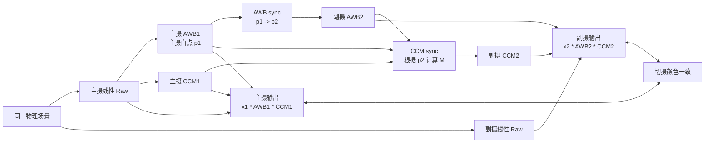
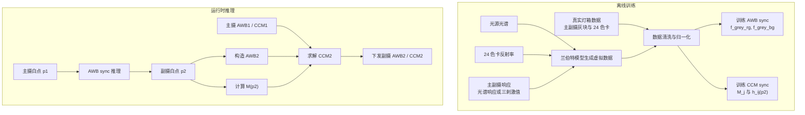
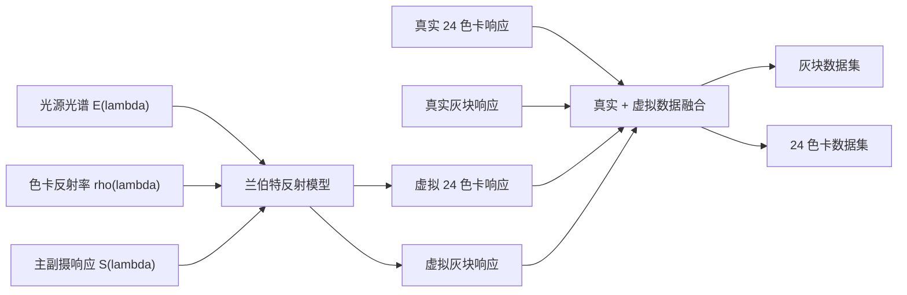
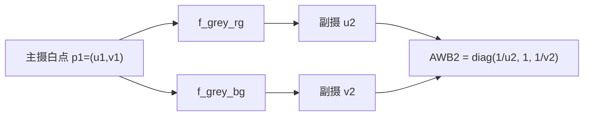
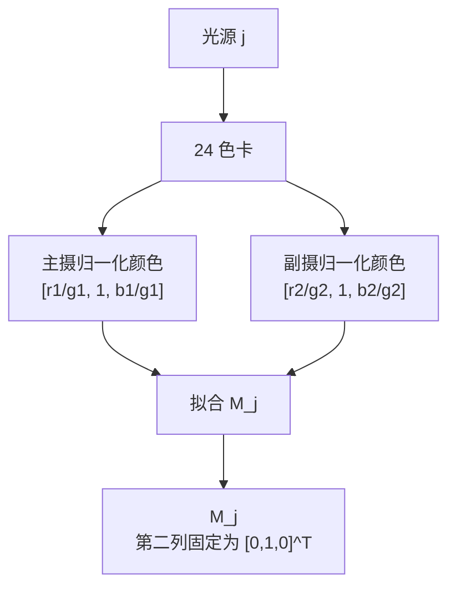
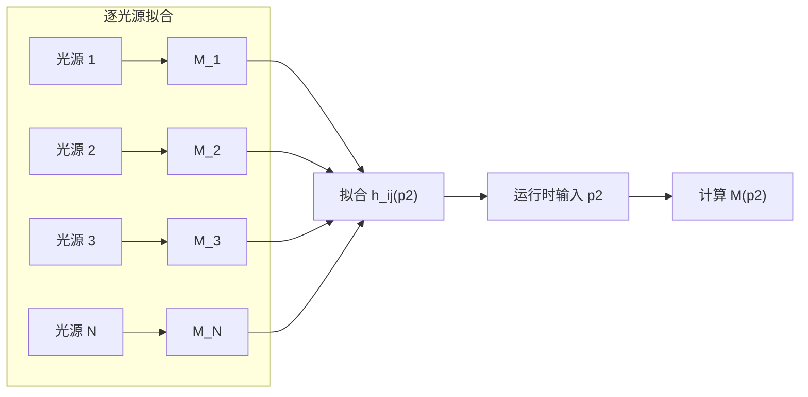
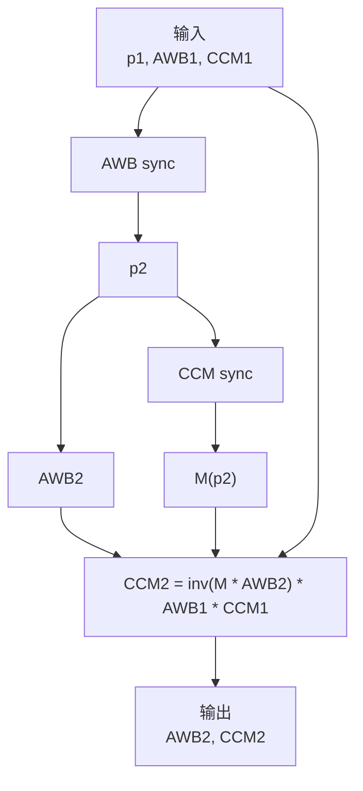
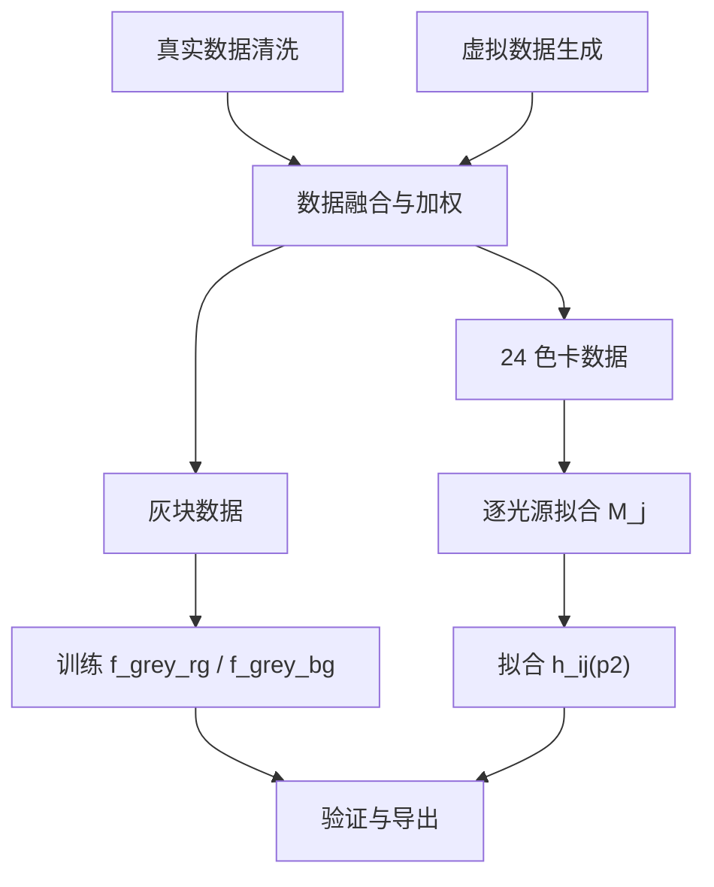

# 跨模组 AWB/CCM 算法一致性方案

## 1. 文档目的

本文描述一套面向多摄切换的颜色一致性算法。该算法以主摄当前 AWB 和 CCM 为参考，通过 **AWB sync** 与 **CCM sync** 两个模块，推导副摄应使用的 AWB 与 CCM，使主摄和副摄在切换过程中获得尽量一致的颜色表现。

多摄系统中，不同模组的传感器光谱响应、镜头透过率、IR cut、工艺偏差和 ISP 标定结果均存在差异。同一物理场景在不同摄像头上会形成不同的 Raw RGB 响应。如果不做跨模组同步，切换时容易出现白平衡跳变、肤色漂移、饱和度变化和局部色相不连续。

本方案的核心思路是：

- 用灰块数据学习主摄白点到副摄白点的映射，得到副摄 AWB。
- 用 24 色卡数据学习不同光源下主副摄的彩色响应映射，得到副摄 CCM。
- 以主摄颜色链路 `AWB1 * CCM1` 为目标，计算副摄颜色链路 `AWB2 * CCM2`。



## 2. 基本约定与适用前提

### 2.1 矩阵方向

本文采用**行向量右乘矩阵**的形式：

```math
y = x A C
```

其中：

- `x` 为线性 RGB 行向量。
- `A` 为 AWB 对角增益矩阵。
- `C` 为 CCM。

因此主摄和副摄的颜色一致性目标写为：

```math
x_1 A_1 C_1 \approx x_2 A_2 C_2
```

其中：

- `x_1`：主摄线性 RGB 响应。
- `x_2`：副摄线性 RGB 响应。
- `A_1`：主摄 AWB 矩阵。
- `A_2`：副摄 AWB 矩阵。
- `C_1`：主摄 CCM。
- `C_2`：副摄 CCM。

如果平台采用列向量或矩阵左乘形式，所有公式需要整体转置，不能直接照搬矩阵顺序。

### 2.2 白点与归一化颜色

白点使用 `G` 通道归一化的二维坐标表示：

```math
p_i = (u_i, v_i) =
\left(
\frac{r_i}{g_i},
\frac{b_i}{g_i}
\right)
```

其中 `i = 1` 表示主摄，`i = 2` 表示副摄。

对灰块或色块样本，定义归一化颜色向量：

```math
\tilde{x}_i =
\left[
\frac{r_i}{g_i},\ 1,\ \frac{b_i}{g_i}
\right]
=
[u_i,\ 1,\ v_i]
```

本文中 AWB sync 和 CCM sync 的训练均基于该归一化颜色域。也就是说，算法重点解决主副摄之间的**色度一致性**，整体亮度和曝光尺度由 AE、增益和后级亮度链路处理。

### 2.3 适用前提

本方案成立需要满足以下条件：

- 主摄和副摄输入数据均来自扣黑、线性化后的 Raw RGB 或等效线性 RGB 域。
- 训练数据和运行时数据的 LSC、BLC、DPC、通道顺序、矩阵方向保持一致。
- 主摄 AWB 和 CCM 已经相对稳定，可作为副摄颜色同步目标。
- 主副摄观察的是同一类场景内容，且不存在严重遮挡、视差导致的主体完全不同。
- 色块和灰块统计值未饱和，且 ROI 避开反光、阴影和高噪声区域。
- CCM sync 中的映射矩阵 `M` 是 G 归一化色度域下的近似映射，不能直接解释为完整曝光尺度下的 Raw 响应映射。

## 3. 总体流程

算法分为离线训练和运行时推理两个阶段。

离线训练阶段构建真实数据和虚拟数据：

- 真实数据来自灯箱中主副摄同步采集的 24 色卡和灰块数据。
- 虚拟数据来自光源光谱、24 色卡反射率，以及主副摄光谱响应或等效三刺激值，通过兰伯特反射模型生成。

运行时推理阶段使用主摄 AWB/CCM：

1. 主摄 AWB 给出当前白点 `p_1`。
2. AWB sync 根据 `p_1` 预测副摄白点 `p_2`，并构造 `A_2`。
3. CCM sync 根据 `p_2` 计算当前光源下的主副摄色彩映射 `M(p_2)`。
4. 根据 `A_1`、`C_1`、`A_2`、`M(p_2)` 求解 `C_2`。



## 4. 标定数据构建

### 4.1 真实数据

真实数据用于锚定算法在实际模组和实际 ISP 链路下的表现。推荐在灯箱中覆盖典型色温和光源类型，例如 A、U30、TL84、CWF、D50、D65、D75，以及项目关注的 LED 或混合光场景。

每个光源场景下，应采集：

- 主摄和副摄 24 色卡 Raw 数据。
- 主摄和副摄灰块 Raw 数据，可使用色卡中客观灰块，也可使用独立灰卡。
- 每个 ROI 的线性 RGB 统计值。
- 曝光时间、模拟增益、数字增益、色温标签、光源标签和数据版本。

数据清洗建议包括：

- 扣除黑电平并确认 Raw 响应线性。
- 剔除饱和、欠曝、反光、阴影和异常 ROI。
- 对 ROI 使用均值、截尾均值或中位数，降低噪声和坏点影响。
- 确认主副摄数据经过一致的前处理模块，例如 BLC、LSC 和通道重排。

### 4.2 虚拟数据

虚拟数据用于扩展光源覆盖范围，缓解真实灯箱数据有限导致的插值和外推问题。

对光源 `l`、色块 `c`、模组 `i`、颜色通道 `q`，基于兰伯特反射模型计算相机响应。若能够测得完整通道光谱响应，则使用 `S_{i,q}(lambda)`；若只有三刺激值或等效响应标定结果，则需要先转换为可用于虚拟数据生成的等效响应模型。

```math
X_{i,c,l,q}
=
\int_{\lambda}
E_l(\lambda)\,
\rho_c(\lambda)\,
S_{i,q}(\lambda)\,
d\lambda
```

其中：

- `E_l(lambda)`：光源光谱功率分布。
- `rho_c(lambda)`：色卡反射率。
- `S_{i,q}(lambda)`：模组 `i` 在通道 `q` 上的光谱响应，或由三刺激值标定得到的等效响应。
- `X_{i,c,l,q}`：虚拟相机响应。

虚拟灰块可由中性反射率曲线生成，也可由真实灰块数据校准后扩展。虚拟数据不能完全替代真实数据，因为光谱响应测量误差、镜头杂散光、flare、IR 泄漏和 ISP 前处理差异都会影响真实成像。工程上建议真实数据权重高于虚拟数据，虚拟数据主要用于增强光源空间的连续性。



## 5. AWB Sync 原理

AWB sync 的目标是：已知主摄当前白点 `p_1`，预测同一光源在副摄上的白点 `p_2`。

### 5.1 灰块映射数据

对每个真实或虚拟光源样本 `j`，提取主摄和副摄灰块归一化白点：

```math
p_{1,j} =
(u_{1,j}, v_{1,j}) =
\left(
\frac{r_{1,j}}{g_{1,j}},
\frac{b_{1,j}}{g_{1,j}}
\right)
```

```math
p_{2,j} =
(u_{2,j}, v_{2,j}) =
\left(
\frac{r_{2,j}}{g_{2,j}},
\frac{b_{2,j}}{g_{2,j}}
\right)
```

构建灰块映射数据集：

```math
\mathcal{D}_{grey}
=
\left\{
(u_{1,j},v_{1,j}) \rightarrow (u_{2,j},v_{2,j})
\right\}_{j=1}^{N}
```

### 5.2 灰轴多项式拟合

分别拟合 `r/g` 和 `b/g` 两个映射函数：

```math
u_2 = f^{grey}_{rg}(u_1, v_1)
```

```math
v_2 = f^{grey}_{bg}(u_1, v_1)
```

例如使用二阶多项式基函数：

```math
\phi(u,v) =
[1,\ u,\ v,\ u^2,\ uv,\ v^2]
```

则：

```math
f^{grey}_{rg}(u,v) = \theta_{rg}^{T}\phi(u,v)
```

```math
f^{grey}_{bg}(u,v) = \theta_{bg}^{T}\phi(u,v)
```

训练目标可写为：

```math
\min_{\theta}
\sum_j
\alpha_j
\left(
\theta^T \phi(u_{1,j}, v_{1,j}) - y_j
\right)^2
+ \lambda \|\theta\|_2^2
```

其中 `y_j` 分别为 `u_{2,j}` 或 `v_{2,j}`，`alpha_j` 为样本权重。真实灯箱数据通常应设置更高权重，虚拟数据用于补充光源覆盖并约束趋势。

### 5.3 运行时 AWB2 计算

运行时主摄 AWB 给出当前白点：

```math
p_1 = (u_1, v_1)
```

AWB sync 预测副摄白点：

```math
\hat{u}_2 = f^{grey}_{rg}(u_1, v_1)
```

```math
\hat{v}_2 = f^{grey}_{bg}(u_1, v_1)
```

副摄 AWB 矩阵为：

```math
A_2 =
\begin{bmatrix}
1 / \hat{u}_2 & 0 & 0 \\
0 & 1 & 0 \\
0 & 0 & 1 / \hat{v}_2
\end{bmatrix}
```



## 6. CCM Sync 原理

AWB sync 只能保证灰轴一致，不能保证彩色色块一致。不同模组的光谱响应不匹配会导致同一光源下 24 色卡的色相和饱和度映射不同；更重要的是，这种映射还会随光源变化。因此 CCM sync 需要使用 24 色卡数据，并且必须显式考虑光源条件。

### 6.1 单光源下的 24 色卡矩阵

对每个光源场景 `j`，有 24 个色块的主副摄归一化数据对：

```math
\tilde{x}_{1,c,j}
=
\left[
\frac{r_{1,c,j}}{g_{1,c,j}},
1,
\frac{b_{1,c,j}}{g_{1,c,j}}
\right]
```

```math
\tilde{x}_{2,c,j}
=
\left[
\frac{r_{2,c,j}}{g_{2,c,j}},
1,
\frac{b_{2,c,j}}{g_{2,c,j}}
\right]
```

在该光源下拟合一个主摄到副摄的归一化颜色映射矩阵 `M_j`：

```math
\tilde{x}_{2,c,j} \approx \tilde{x}_{1,c,j} M_j
```

由于输入输出都进行了 G 通道归一化，输出第二维恒为 `1`。因此约束 `M_j` 的第二列为 `[0, 1, 0]^T`：

```math
M_j =
\begin{bmatrix}
w_{11,j} & 0 & w_{13,j} \\
w_{21,j} & 1 & w_{23,j} \\
w_{31,j} & 0 & w_{33,j}
\end{bmatrix}
```

展开后：

```math
\frac{r_{2,c,j}}{g_{2,c,j}}
=
w_{11,j}
\frac{r_{1,c,j}}{g_{1,c,j}}
+ w_{21,j}
+ w_{31,j}
\frac{b_{1,c,j}}{g_{1,c,j}}
```

```math
\frac{b_{2,c,j}}{g_{2,c,j}}
=
w_{13,j}
\frac{r_{1,c,j}}{g_{1,c,j}}
+ w_{23,j}
+ w_{33,j}
\frac{b_{1,c,j}}{g_{1,c,j}}
```

因此每个光源下只需要对 `r/g` 和 `b/g` 两个目标分别做线性最小二乘，就能得到 `M_j` 的 6 个自由参数。



### 6.2 为什么不能直接混合所有色卡训练

如果将所有光源下的 24 色卡样本直接混在一起，训练一个不带光源条件的全局映射，会引入标签冲突。原因是传感器光谱响应不匹配时，同一个主摄归一化颜色在不同光源下可能对应不同的副摄归一化颜色。

因此，CCM sync 不直接训练一个全局无条件函数，而是采用两级建模：

1. 每个光源单独拟合一个局部矩阵 `M_j`。
2. 再拟合 `M_j` 中各个矩阵系数随副摄白点 `p_2` 的变化关系。

这样既保留单光源下 24 色卡映射的稳定性，又让运行时矩阵可以随光源平滑变化。

### 6.3 光源条件化矩阵

设副摄白点为：

```math
p_2 = (u_2^g, v_2^g)
```

定义随副摄白点变化的矩阵：

```math
M(p_2) =
\begin{bmatrix}
h_{11}(p_2) & 0 & h_{13}(p_2) \\
h_{21}(p_2) & 1 & h_{23}(p_2) \\
h_{31}(p_2) & 0 & h_{33}(p_2)
\end{bmatrix}
```

其中 `h_11`、`h_13`、`h_21`、`h_23`、`h_31`、`h_33` 均为关于 `p_2` 的多项式或其他平滑函数。

对训练集中每个光源 `j`，要求：

```math
M(p_{2,j}) \approx M_j
```

等价于分别拟合 6 个系数函数：

```math
h_{11}(p_{2,j}) \approx w_{11,j},\quad
h_{21}(p_{2,j}) \approx w_{21,j},\quad
h_{31}(p_{2,j}) \approx w_{31,j}
```

```math
h_{13}(p_{2,j}) \approx w_{13,j},\quad
h_{23}(p_{2,j}) \approx w_{23,j},\quad
h_{33}(p_{2,j}) \approx w_{33,j}
```

训练目标可写为：

```math
\min_{\Theta}
\sum_j
\beta_j
\left\|
M(p_{2,j}; \Theta) - M_j
\right\|_F^2
+ \lambda R(\Theta)
```

其中 `beta_j` 为光源权重，`R(Theta)` 为正则项，用于限制多项式过拟合和边界振荡。



## 7. CCM2 求解

运行时，CCM sync 根据副摄白点得到当前光源下的归一化颜色映射：

```math
\tilde{x}_2 \approx \tilde{x}_1 M
```

为简化符号，以下推导中的 `x_1` 和 `x_2` 均表示与 `\tilde{x}_1`、`\tilde{x}_2` 一致的 G 归一化颜色向量。该推导不处理绝对亮度尺度。

跨模组颜色一致性目标为：

```math
x_1 A_1 C_1 \approx x_2 A_2 C_2
```

将 `x_2 ≈ x_1 M` 代入：

```math
x_1 A_1 C_1
\approx
x_1 M A_2 C_2
```

若希望该关系对任意输入颜色近似成立，则有：

```math
A_1 C_1 \approx M A_2 C_2
```

因此：

```math
C_2 =
(M A_2)^{-1} A_1 C_1
```

工程表达式为：

```text
ccm2 = inv(M * awb2) * awb1 * ccm1
```

其中：

- `awb1` 为主摄当前 AWB 矩阵。
- `ccm1` 为主摄当前 CCM。
- `awb2` 由 AWB sync 根据 `p_1` 预测得到。
- `M` 由 CCM sync 根据副摄白点 `p_2` 计算得到。



## 8. 离线训练规范

推荐离线训练按如下顺序执行：

1. 清洗真实灯箱数据，得到每个光源下主副摄灰块和 24 色卡 RGB。
2. 使用光源光谱、色卡反射率和模组光谱响应或等效三刺激值生成虚拟灰块与虚拟 24 色卡数据。
3. 合并真实和虚拟数据，并设置样本权重。
4. 用灰块数据训练 `f_grey_rg` 和 `f_grey_bg`。
5. 对每个光源单独拟合 `M_j`。
6. 用 `{p_{2,j}, M_j}` 训练 `h_ij(p_2)`。
7. 在独立验证集上评估 AWB 误差、色卡误差和切摄一致性。
8. 导出模型参数、训练范围、版本信息和 fallback 参数。



训练输出建议包含：

- AWB sync 参数：`f_grey_rg`、`f_grey_bg` 的多项式系数。
- CCM sync 参数：`h_11`、`h_13`、`h_21`、`h_23`、`h_31`、`h_33` 的系数。
- 主摄白点有效范围和副摄白点有效范围。
- 训练光源列表、色卡版本、光谱数据版本和模组响应/三刺激值版本。
- 真实数据权重、虚拟数据权重、正则参数和多项式阶数。
- 运行时边界裁剪、矩阵条件数阈值和回退矩阵。

## 9. 运行时流程

```text
Input:
  p1    = 当前主摄白点 (r1/g1, b1/g1)
  AWB1  = 当前主摄 AWB 矩阵
  CCM1  = 当前主摄 CCM

Step 1: AWB sync
  u2 = f_grey_rg(p1)
  v2 = f_grey_bg(p1)
  AWB2 = diag(1/u2, 1, 1/v2)

Step 2: CCM sync
  p2 = (u2, v2)
  M = M(p2)

Step 3: 求解副摄 CCM
  CCM2 = inv(M * AWB2) * AWB1 * CCM1

Output:
  AWB2, CCM2
```

运行时保护策略：

- 若 `p_1` 超出 AWB sync 训练范围，对 `p_1` 做边界裁剪或回退。
- 若预测得到的 `p_2` 超出 CCM sync 训练范围，对 `p_2` 做边界裁剪或回退。
- 若 `M * AWB2` 条件数过大，不直接求逆，改用正则化逆或回退 CCM。
- 对 `AWB2` 和 `CCM2` 做时间滤波，避免主摄 AWB 抖动造成副摄颜色闪烁。
- 切摄前后保持 AE、AWB、CCM 生效帧时序对齐。

## 10. 质量评估

### 10.1 AWB Sync 评估

在独立验证光源上评估副摄白点预测误差：

```math
e_{awb}
=
\sqrt{
(\hat{u}_2-u_2)^2
+
(\hat{v}_2-v_2)^2
}
```

建议统计：

- `r/g` 和 `b/g` 的平均误差、P95 误差和最大误差。
- 主副摄灰块经过 AWB 后的残余色偏。
- 不同色温段、不同光源类型下的误差分布。
- 真实数据验证误差和虚拟数据验证误差分别统计。

### 10.2 CCM Sync 评估

对验证集中的 24 色卡比较：

```math
x_1 A_1 C_1
```

与：

```math
x_2 A_2 C_2
```

之间的颜色差异。

建议统计：

- 24 色卡平均 `Delta E`、P95 `Delta E` 和最大 `Delta E`。
- 肤色、蓝天、绿植、红色、黄色等关键色块单独误差。
- 色相误差、饱和度误差和亮度误差。
- 每个光源单独统计，而不是只看所有光源的全局平均值。
- 切摄视频中的帧间颜色跳变量。

### 10.3 工程验证

量产前建议至少完成三类验证：

- 灯箱 hold-out 验证：保留部分真实光源不参与训练，只用于测试。
- 实景切摄验证：覆盖室内、室外、低照、逆光、混合光和 LED 场景。
- 硬件下发验证：评估 AWB gain、CCM 定点化、矩阵范围限制和帧同步延迟造成的误差。

## 11. 主要风险与改进方向

### 11.1 白点不能完全代表光源

不同光源可能在 `(r/g, b/g)` 空间中位置接近，但光谱分布不同。窄带 LED、混合光和荧光光源尤其容易产生同白点异光谱问题。此时只用白点作为 CCM sync 条件可能不足。

可改进方向：

- 引入 AWB 的多光源置信度或光源类别作为额外条件。
- 对 LED、混合光建立独立分支或回退策略。
- 使用更丰富的场景统计特征辅助判断光源。

### 11.2 归一化映射不是完整 Raw 映射

`M` 在 G 归一化色度域中拟合，主要描述色度关系，而不是完整亮度尺度关系。如果后续平台希望直接在完整 Raw 域解释 `M`，需要额外标定主副摄曝光比例或使用未归一化 RGB 数据重新建模。

### 11.3 虚拟数据存在模型误差

兰伯特模型假设表面为理想漫反射，且依赖准确的光源光谱、色卡反射率和模组响应。如果只使用三刺激值构建等效响应，虚拟数据的光谱细节会进一步受限。实际成像中的 flare、镜头 shading、IR 泄漏、传感器串扰和 ISP 前处理都会引入偏差。因此虚拟数据适合补充趋势，不适合无约束地主导训练。

### 11.4 多项式外推风险

多项式在训练范围外可能振荡或发散。运行时必须监控 `p_1` 和 `p_2` 是否落在训练有效范围内，并对极端色温、低照高噪和异常光源做保护。

## 12. 总结

本方案将跨模组颜色一致性拆解为两个问题：

- **AWB sync**：在灰轴上学习主摄白点到副摄白点的映射，解决同一光源在不同模组上的白点差异。
- **CCM sync**：在 24 色卡上学习光源条件化的主副摄颜色映射，解决灰轴以外的色相和饱和度差异。

最终通过：

```math
C_2 =
(M A_2)^{-1} A_1 C_1
```

将主摄颜色链路迁移到副摄。该方法具有清晰的离线训练和运行时推理路径，适合作为多摄切换颜色一致性的基础方案。工程落地时，需要重点保证数据域一致、光源覆盖充分、矩阵求逆稳定，并通过真实场景切摄验证算法效果。
