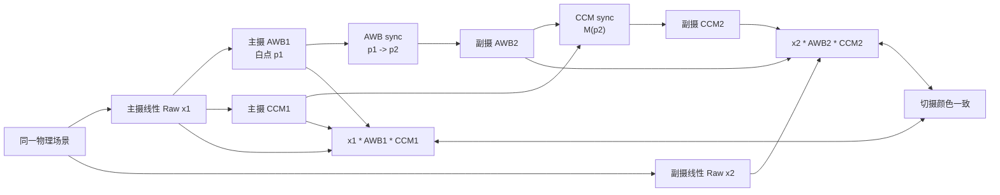
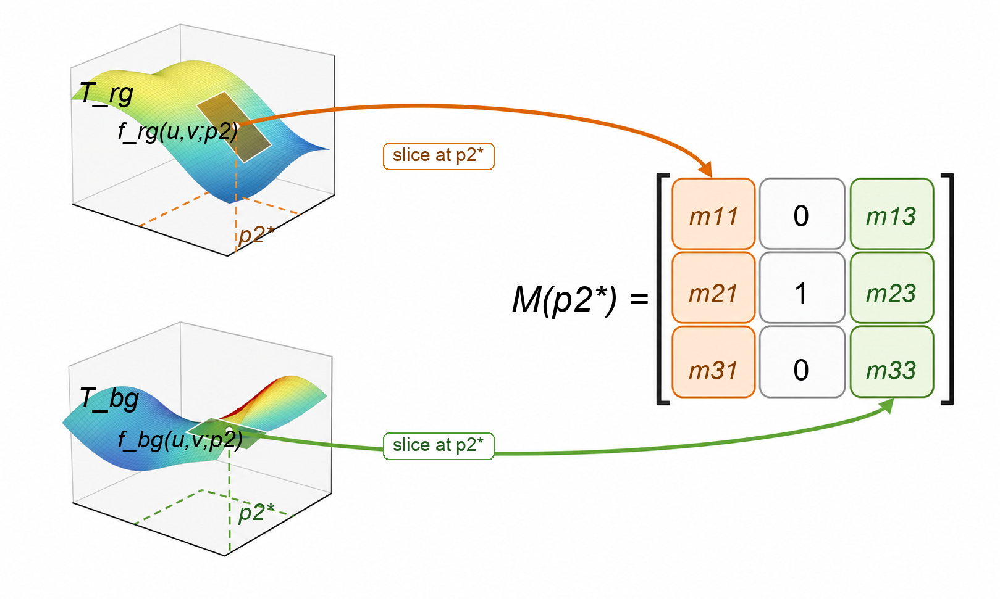
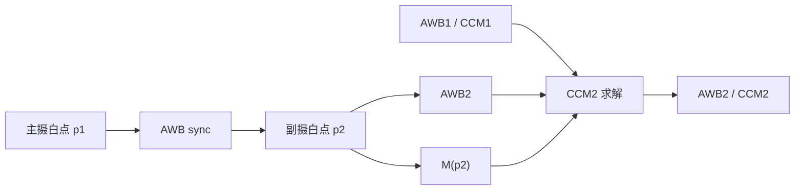

# 跨模组 AWB/CCM 算法一致性方案

本文描述一套面向多摄切换的颜色一致性算法。方案以主摄当前 AWB 和 CCM 为参考，通过 **AWB sync** 与 **CCM sync** 推导副摄 AWB 和 CCM，使主摄与副摄在切换过程中获得尽量一致的颜色表现。

详细的数据构建、训练规范、验证指标和工程风险见 [algorithm_details.md](docs/algorithm_details.md)。
训练数据字段约定见 [data_schema.md](docs/data_schema.md)。

## 当前项目形态

本仓库现在包含三部分内容：

- 算法说明：本文和 `docs/algorithm_details.md`。
- 数据契约：`docs/data_schema.md`，定义灰块、色卡和导出参数的字段约定。
- 参考实现：`src/awb_ccm_sync`，覆盖 AWB 多项式映射、单光源 CCM 矩阵拟合、白点条件化 CCM sync 和运行时 `CCM2` 求解。

快速验证：

```bash
python3 -m pytest
```

运行合成仿真，验证从训练到运行时求解的完整通路：

```bash
python3 scripts/run_simulation.py
```

运行公开光谱数据仿真，使用 `colour-science` 内置的光源 SPD、BabelColor ColorChecker 光谱反射率和 NPL 相机光谱响应：

```bash
python3 scripts/run_spectral_simulation.py
```

最小调用示例：

```python
import numpy as np

from awb_ccm_sync import (
    AWBSyncModel,
    CCMSyncModel,
    awb_matrix_from_white_point,
    fit_local_ccm_matrix,
    sync_runtime,
)

# main_white_points/sub_white_points: shape (n, 2), each row is (r/g, b/g).
awb_model = AWBSyncModel.fit(main_white_points, sub_white_points, degree=2, l2=1e-6)

# Per illuminant, fit a local normalized mapping M_j from 24 color patches.
local_m = fit_local_ccm_matrix(main_patch_rgb, sub_patch_rgb, l2=1e-6)

# local_matrices: shape (n_illuminants, 3, 3), aligned with sub_white_points.
ccm_model = CCMSyncModel.fit(sub_white_points, local_matrices, degree=2, l2=1e-6)

result = sync_runtime(
    main_white_point=np.array([1.25, 0.82]),
    main_awb=awb_matrix_from_white_point([1.25, 0.82]),
    main_ccm=current_main_ccm,
    awb_model=awb_model,
    ccm_model=ccm_model,
    cond_max=1e4,
    regularization=1e-6,
)

awb2 = result.sub_awb
ccm2 = result.sub_ccm
```

## 1. 目标与核心思路

多摄系统中，不同模组的传感器光谱响应、镜头透过率、IR cut、工艺偏差和 ISP 标定结果不完全一致。同一场景在不同摄像头上会形成不同的 Raw RGB 响应。如果不做同步，切换时容易出现白平衡跳变、肤色漂移、饱和度变化和局部色相不连续。

本方案将问题拆成两层：

- **AWB sync**：用灰块数据学习主摄白点到副摄白点的映射，得到副摄 AWB。
- **CCM sync**：用 24 色卡数据学习不同光源下的主副摄彩色响应映射，得到副摄 CCM。

整体目标是让副摄颜色链路对齐主摄颜色链路：

```math
x_1 A_1 C_1 \approx x_2 A_2 C_2
```

其中 `x_1/x_2` 为主摄/副摄线性 RGB 行向量，`A_1/A_2` 为 AWB 矩阵，`C_1/C_2` 为 CCM。



## 2. 符号与数据域约定

本文采用**行向量右乘矩阵**约定：

```math
y = x A C
```

如果平台使用列向量或矩阵左乘形式，公式需要整体转置，不能直接照搬矩阵顺序。

白点使用 G 通道归一化坐标表示：

```math
p_i = (u_i, v_i) =
\left(
\frac{r_i}{g_i},
\frac{b_i}{g_i}
\right)
```

色块或灰块的归一化颜色向量定义为：

```math
\tilde{x}_i =
\left[
\frac{r_i}{g_i},\ 1,\ \frac{b_i}{g_i}
\right]
=
[u_i,\ 1,\ v_i]
```

关键前提：

- 训练和运行时都应处在扣黑、线性化后的 Raw RGB 或等效线性 RGB 域。
- 通道顺序、矩阵方向、BLC/LSC 等前处理链路必须一致。
- CCM sync 中的 `M` 是 G 归一化色度域下的近似映射，不负责完整曝光和亮度尺度。
- 主摄 AWB/CCM 需要足够稳定，因为副摄同步结果以主摄链路为目标。

## 3. 数据来源

离线训练使用两类数据：

- **真实数据**：灯箱中主副摄同步采集的灰块和 24 色卡 Raw 数据。
- **虚拟数据**：由光源光谱、24 色卡反射率、主副摄光谱响应或等效三刺激值，通过兰伯特反射模型生成。

虚拟响应可写为：

```math
X_{i,c,l,q}
=
\int_{\lambda}
E_l(\lambda)\,
\rho_c(\lambda)\,
S_{i,q}(\lambda)\,
d\lambda
```

其中 `E_l(lambda)` 为光源光谱，`rho_c(lambda)` 为色卡反射率，`S_{i,q}(lambda)` 为模组 `i` 在通道 `q` 上的光谱响应或等效响应。

真实数据用于锚定实际模组表现，虚拟数据用于扩展光源覆盖范围。工程上通常应给真实数据更高权重。

## 4. AWB Sync

AWB sync 的目标是：已知主摄当前白点 `p_1`，预测同一光源在副摄上的白点 `p_2`。

对每个光源样本 `j`，提取灰块归一化白点：

```math
p_{1,j} =
\left(
\frac{r_{1,j}}{g_{1,j}},
\frac{b_{1,j}}{g_{1,j}}
\right),
\quad
p_{2,j} =
\left(
\frac{r_{2,j}}{g_{2,j}},
\frac{b_{2,j}}{g_{2,j}}
\right)
```

分别拟合两个二维多项式：

```math
u_2 = f^{grey}_{rg}(u_1, v_1)
```

```math
v_2 = f^{grey}_{bg}(u_1, v_1)
```

运行时由主摄白点 `p_1=(u_1,v_1)` 得到副摄白点：

```math
\hat{u}_2 = f^{grey}_{rg}(u_1, v_1),
\quad
\hat{v}_2 = f^{grey}_{bg}(u_1, v_1)
```

副摄 AWB 矩阵为：

```math
A_2 =
\begin{bmatrix}
1 / \hat{u}_2 & 0 & 0 \\
0 & 1 & 0 \\
0 & 0 & 1 / \hat{v}_2
\end{bmatrix}
```

## 5. CCM Sync

AWB sync 只能保证灰轴一致，不能保证彩色色块一致。由于主副摄光谱响应不匹配，同一光源下 24 色卡的色相和饱和度映射会存在差异，并且这种差异会随光源变化。

### 5.1 单光源矩阵

对每个光源 `j`，使用 24 色卡数据拟合主摄到副摄的归一化颜色映射：

```math
\tilde{x}_{2,c,j} \approx \tilde{x}_{1,c,j} M_j
```

由于输入输出都进行了 G 通道归一化，`M_j` 的第二列固定为 `[0,1,0]^T`：

```math
M_j =
\begin{bmatrix}
w_{11,j} & 0 & w_{13,j} \\
w_{21,j} & 1 & w_{23,j} \\
w_{31,j} & 0 & w_{33,j}
\end{bmatrix}
```

展开后：

```math
\frac{r_2}{g_2}
=
w_{11}
\frac{r_1}{g_1}
+ w_{21}
+ w_{31}
\frac{b_1}{g_1}
```

```math
\frac{b_2}{g_2}
=
w_{13}
\frac{r_1}{g_1}
+ w_{23}
+ w_{33}
\frac{b_1}{g_1}
```

因此每个光源下只需要对 `r/g` 和 `b/g` 两个目标分别做线性最小二乘，就能得到 `M_j` 的 6 个自由参数。

### 5.2 光源条件化矩阵

不能把所有光源下的 24 色卡直接混合训练一个无条件全局映射。主副摄光谱响应不匹配时，同一个主摄归一化颜色在不同光源下可能对应不同副摄颜色，直接混训会产生标签冲突。

更稳妥的建模方式是：

1. 每个光源单独拟合局部矩阵 `M_j`。
2. 再拟合 `M_j` 的各个矩阵系数随副摄白点 `p_2` 的变化关系。

定义运行时矩阵：

```math
M(p_2) =
\begin{bmatrix}
h_{11}(p_2) & 0 & h_{13}(p_2) \\
h_{21}(p_2) & 1 & h_{23}(p_2) \\
h_{31}(p_2) & 0 & h_{33}(p_2)
\end{bmatrix}
```

其中 `h_11`、`h_13`、`h_21`、`h_23`、`h_31`、`h_33` 为关于副摄白点 `p_2` 的多项式或其他平滑函数。

### 5.3 两个多项式切面构造矩阵 M

从运行时角度看，CCM sync 可以理解为两个光源条件化彩色多项式：

```math
f_{rg}(u,v;p_2),
\quad
f_{bg}(u,v;p_2)
```

其中 `u=r_1/g_1`，`v=b_1/g_1`。`f_rg` 预测副摄 `r_2/g_2`，`f_bg` 预测副摄 `b_2/g_2`。

固定 AWB sync 预测得到的副摄白点：

```math
p_2 = p_2^*
```

两个多项式在当前光源位置形成切面：

```math
f_{rg}(u,v;p_2^*) =
m_{11}u + m_{21} + m_{31}v
```

```math
f_{bg}(u,v;p_2^*) =
m_{13}u + m_{23} + m_{33}v
```

于是得到：

```math
M(p_2^*) =
\begin{bmatrix}
m_{11} & 0 & m_{13} \\
m_{21} & 1 & m_{23} \\
m_{31} & 0 & m_{33}
\end{bmatrix}
```



图中上方曲面表示 `f_rg(u,v;p_2)`，下方曲面表示 `f_bg(u,v;p_2)`。固定副摄白点 `p_2^*` 后，`f_rg` 切面的系数进入 `M` 的第一列，`f_bg` 切面的系数进入 `M` 的第三列，中间列由 G 归一化约束固定为 `[0,1,0]^T`。

## 6. CCM2 求解

运行时，CCM sync 给出当前光源下的归一化颜色映射：

```math
\tilde{x}_2 \approx \tilde{x}_1 M
```

为简化符号，以下推导中的 `x_1` 和 `x_2` 均表示 G 归一化颜色向量。跨模组颜色一致性目标为：

```math
x_1 A_1 C_1 \approx x_2 A_2 C_2
```

将 `x_2 \approx x_1 M` 代入：

```math
x_1 A_1 C_1
\approx
x_1 M A_2 C_2
```

若希望该关系对任意输入颜色近似成立，则：

```math
A_1 C_1 \approx M A_2 C_2
```

因此副摄 CCM 为：

```math
C_2 =
(M A_2)^{-1} A_1 C_1
```

工程表达式：

```text
ccm2 = inv(M * awb2) * awb1 * ccm1
```

## 7. 运行时流程

```text
Input:
  p1    = 当前主摄白点 (r1/g1, b1/g1)
  AWB1  = 当前主摄 AWB 矩阵
  CCM1  = 当前主摄 CCM

Step 1: AWB sync
  u2 = f_grey_rg(p1)
  v2 = f_grey_bg(p1)
  AWB2 = diag(1/u2, 1, 1/v2)

Step 2: CCM sync
  p2 = (u2, v2)
  M = M(p2)

Step 3: 求解副摄 CCM
  CCM2 = inv(M * AWB2) * AWB1 * CCM1

Output:
  AWB2, CCM2
```



## 8. 工程注意事项

- `p_1` 或 `p_2` 超出训练范围时，应做边界裁剪或回退到保守标定值。
- `M * AWB2` 条件数过大时，不应直接求逆，可使用正则化逆或回退 CCM；参考实现中的 `solve_ccm2` 已提供该保护入口。
- 切摄过程中建议对 `AWB2` 和 `CCM2` 做时间滤波，避免颜色闪烁。
- 主摄和副摄的 AE、AWB、CCM 生效帧需要对齐，否则同步矩阵可能作用到错误帧。
- 窄带 LED、混合光和同白点异光谱场景中，仅用白点作为条件变量可能不足。

## 9. 文档结构

- 本文：算法主线、核心公式和运行时链路。
- [algorithm_details.md](docs/algorithm_details.md)：数据构建、训练目标、验证指标、fallback 和风险细节。
- [data_schema.md](docs/data_schema.md)：训练输入、中间量和模型导出的字段约定。
